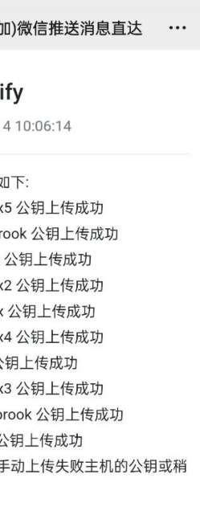
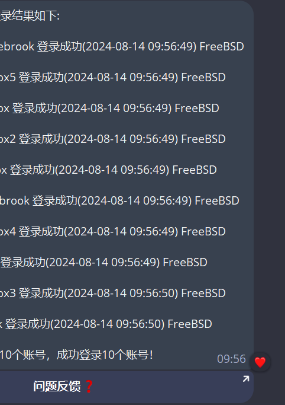
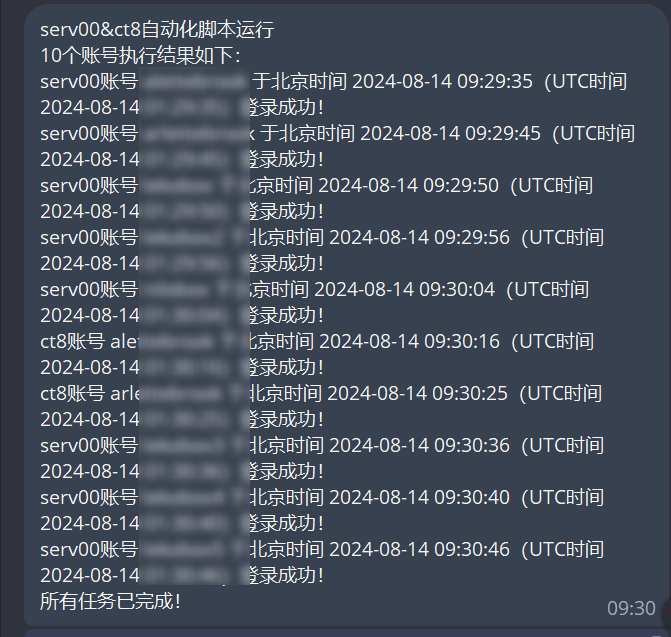
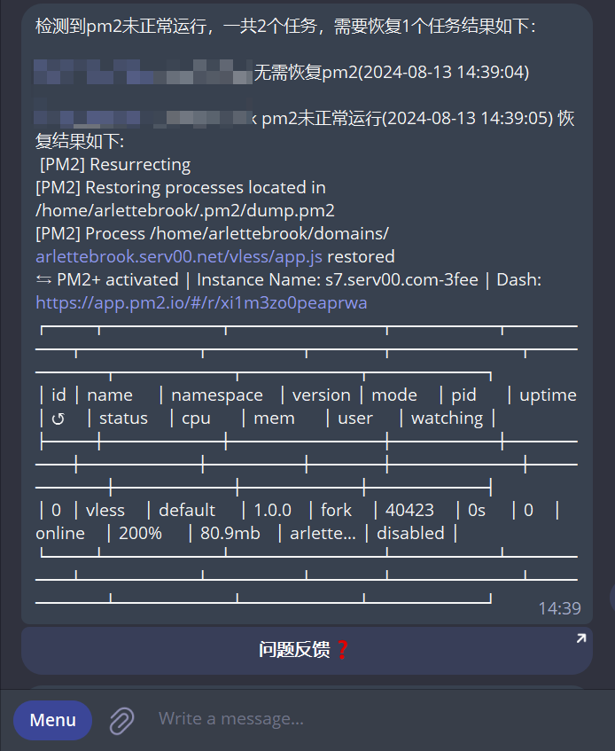

## serv00与ct8自动化批量保号，每3天自动登录一次面板，支持将运行结果发送到Telegram、PushPlus。

## 视频教程看这里
[免费白嫖10年VPS服务器serv00 并且一键部署自己的专属自建Vless节点 ｜小白教程｜自动化批量保号](https://youtu.be/QnlzpvDl_mo)

利用github Action以及python脚本实现

🙏🙏🙏点个Star！！Star！！Star！！

交流群：https://t.me/yxjsjl


# 新增功能介绍

> 同时支持serv00与ct8自动化批量保号、保活。具体支持自动登录面板、自动SSH登录、PM2进程恢复、并支持将结果推送到Telegram Bot、PushPlus微信公众号。

**改变**：

1. 将`ACCOUNTS_JSON`环境变量修改成：

   ```json
   {
     "accounts": [
       {
         "username": "",
         "password": "",
         "panel": "panel6.serv00.com",
         "addr": "s6.serv00.com",
         "is_check": true
       },
       {
         "username": "",
         "password": "",
         "panel": "panel7.serv00.com",
         "addr": "s7.serv00.com"
       },
       {
         "username": "",
         "password": "",
         "panel": "panel.ct8.pl",
         "addr": "s1.ct8.pl",
         "is_check": true
       }
     ]
   }
   ```

   `is_check`默认为false，为true开启pm保活。默认每30分钟运行一次。


**新增**：

1. 新增 `PRIVATE_KEY`环境变量，ssh登录的为私钥。

2. 新增 `log_level`环境变量，默认为info。支持debug，warn级别。


**使用**：

提前配置好`ACCOUNTS_JSON`环境变量，并且一定要配置一个推送渠道，用于接收公钥、私钥。

以下操作在Actions页面进行：

1. 首次使用，需要运行`Run Init`，生成公钥私钥，并会自动上传公钥。

   

2. 但是我测试了，只有我本地能够自动上传，其他环境公钥自动上传会失败。不知道什么原因，**建议误用**。

3. 所以需要手动上传公钥：

   1. 运行`Run Init`之后，会收到公钥、私钥，将私钥保存到`PRIVATE_KEY`环境变量即可。

   2. 公钥手动上传：复制公钥，登录服务器运行：

      ```sh
      vim ~/.ssh/authorized_keys
      ```

      粘贴进去，保存即可。

4. 成功配置之后：

5. 启用SSH自动登录，启用`Run SSH Login`即可：

   

   **默认每28天运行一次**。

6. 启用面板登录，启用`Run Web Login Script`即可：

   

   **默认每7天运行一次**。

7. 启用pm2保活，启用`Run Check PM2`即可：

   

   **每30分钟运行一次**。

   


### 将代码fork到你的仓库并运行的操作步骤

#### 1. Fork 仓库

1. **访问原始仓库页面**：
    - 打开你想要 fork 的 GitHub 仓库页面。

2. **Fork 仓库**：
    - 点击页面右上角的 "Fork" 按钮，将仓库 fork 到你的 GitHub 账户下。

#### 2. 设置 GitHub Secrets

1. **创建 Telegram Bot**
    - 在 Telegram 中找到 `@BotFather`，创建一个新 Bot，并获取 API Token。
    - 获取到你的 Chat ID 方法一，在[一休技术交流群](https://t.me/yxjsjl)里发送`/id@KinhRoBot`获取，返回用户信息中的`ID`就是Chat ID
    - 获取到你的 Chat ID 方法二，可以通过向 Bot 发送一条消息，然后访问 `https://api.telegram.org/bot<your_bot_token>/getUpdates` 找到 Chat ID。

2. **配置 GitHub Secrets**
    - 转到你 fork 的仓库页面。
    - 点击 `Settings`，然后在左侧菜单中选择 `Secrets`。
    - 添加以下 Secrets：
        - `ACCOUNTS_JSON`: 包含账号信息的 JSON 数据。例如：
        - 
          ```json
          [
            {"username": "serv00的账号", "password": "serv00的密码", "panel": "panel6.serv00.com"},
            {"username": "ct8的账号", "password": "ct8的密码", "panel": "panel.ct8.pl"},
            {"username": "user2", "password": "password2", "panel": "panel6.serv00.com"}
          ]
          ```
        - `TELEGRAM_BOT_TOKEN`: 你的 Telegram Bot 的 API Token。
        - `TELEGRAM_CHAT_ID`: 你的 Telegram Chat ID。

    - **获取方法**：
        - 在 Telegram 中创建 Bot，并获取 API Token 和 Chat ID。
        - 在 GitHub 仓库的 Secrets 页面添加这些值，确保它们安全且不被泄露。

#### 3. 启动 GitHub Actions

1. **配置 GitHub Actions**
    - 在你的 fork 仓库中，进入 `Actions` 页面。
    - 如果 Actions 没有自动启用，点击 `Enable GitHub Actions` 按钮以激活它。

2. **运行工作流**
    - GitHub Actions 将会根据你设置的定时任务（例如每三天一次）自动运行脚本。
    - 如果需要手动触发，可以在 Actions 页面手动运行工作流。

#### 示例 Secrets 和获取方法总结

- **TELEGRAM_BOT_TOKEN**
    - 示例值: `1234567890:ABCDEFghijklmnopQRSTuvwxyZ`
    - 获取方法: 在 Telegram 中使用 `@BotFather` 创建 Bot 并获取 API Token。

- **TELEGRAM_CHAT_ID**
    - 示例值: `1234567890`
    - 获取方法: 发送一条消息给你的 Bot，然后访问 `https://api.telegram.org/bot<your_bot_token>/getUpdates` 获取 Chat ID。

- **ACCOUNTS_JSON**
    - 示例值:
      ```json
      [
            {"username": "serv00的账号", "password": "serv00的密码", "panel": "panel6.serv00.com"},
            {"username": "ct8的账号", "password": "ct8的密码", "panel": "panel.ct8.pl"},
            {"username": "user2", "password": "password2", "panel": "panel6.serv00.com"}
          ]
      ```
    - 获取方法: 创建一个包含serv00账号信息的 JSON 文件，并将其内容添加到 GitHub 仓库的 Secrets 中。

- **PUSH_PLUS_TOKEN**

    - 作用：支持将消息推送到pushplus微信公众号。
    - 示例值：`dad8515EFghijklmnopQRSTuvwxyZ444e3bb81f05`
    - 获取方法：关注pushplus微信公众号获取。参考文档 `https://www.pushplus.plus/doc/`。


### 注意事项

- **保密性**: Secrets 是敏感信息，请确保不要将它们泄露到公共代码库或未授权的人员。
- **更新和删除**: 如果需要更新或删除 Secrets，可以通过仓库的 Secrets 页面进行管理。

通过以上步骤，你就可以成功将代码 fork 到你的仓库下并运行它了。如果需要进一步的帮助或有其他问题，请随时告知！

## 🌟🌟🌟Star！！！走起
[](https://starchart.cc/yixiu001/serv00-login)
